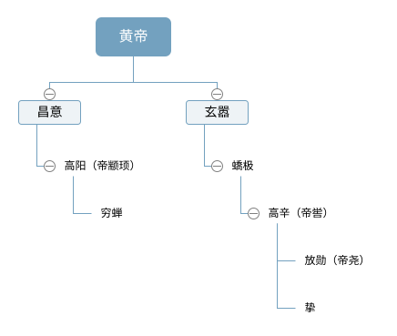

# 五帝本纪

## 黄帝

### 生平简述

黄帝，公孙轩辕。其所处的时期是神农氏统治的末期。当时，神农氏势力衰弱，无力再统治约束各诸侯。有诸侯趁机叛乱，不来朝拜，黄帝率领其他各诸侯征讨不服从者。其中，蚩尤和炎帝实力雄厚，最难征讨。黄帝修德振兵，最终于阪泉之战中打败炎帝，逐鹿一战，擒杀蚩尤。自此，各诸侯尊黄帝为天子，取代神农氏，统领天下。

### 子嗣简谱

## 帝颛顼

帝颛顼静渊有谋，疏通知事，天下皆从。

## 帝喾

帝喾聪以知远，明以察微，仁而威，惠而信，天下亦皆从。

## 帝尧

## 帝舜