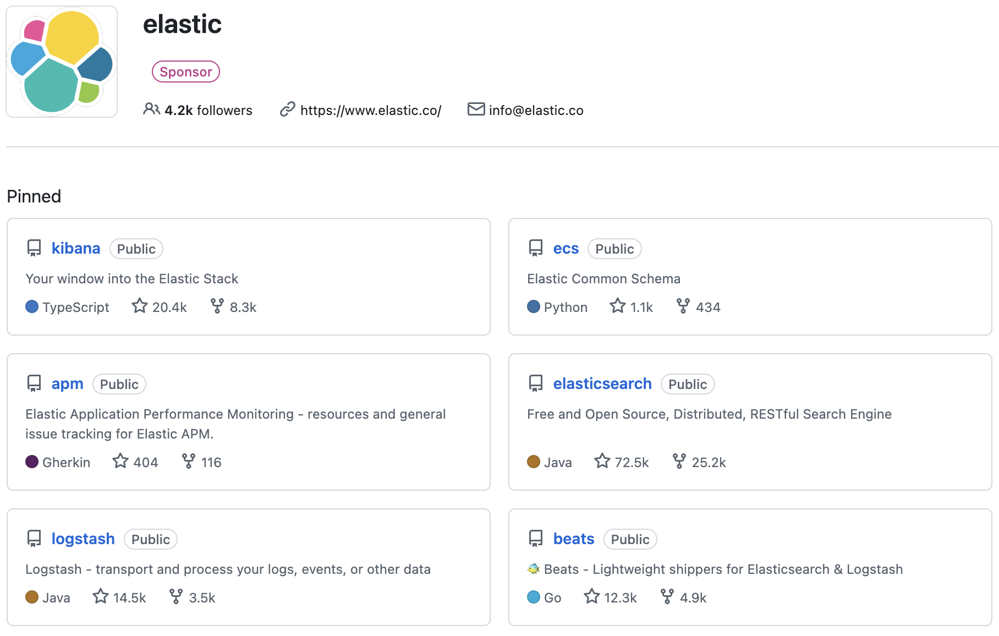

# Elasticsearch简介

## 什么是 Elasticsearch

Elasticsearch 是一个分布式搜索与数据分析引擎。使用 Java 开发。

## Elastic Stack 生态

Elasticsearch 由 Elastic 公司开发，该公司旗下还有几个和 Elasticsearch 搭配使用的产品，统称为 Elastic Stack 生态，如下：

## Elasticsearch 相关网址

- [官方文档](https://www.elastic.co/docs/solutions/search)
- [GitHub](https://github.com/elastic/elasticsearch)
