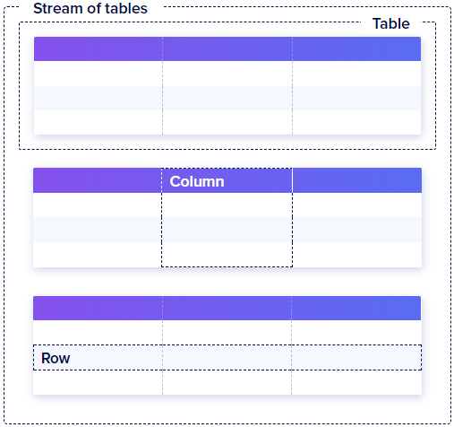
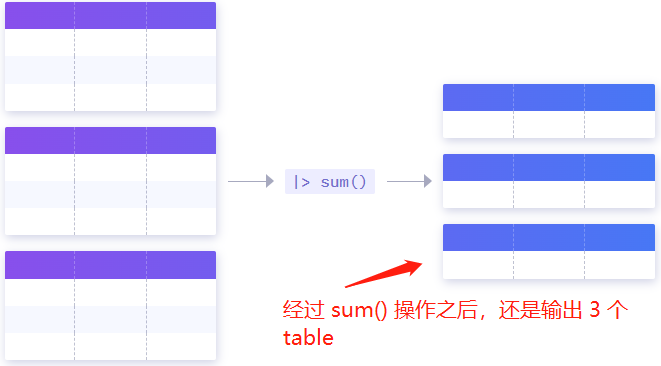

# 数据模型

要理解 flux 查询的过程，根据自己的目标写出符合要求的 flux 语句，必须先理解 flux 数据模型，其组成如下：
- Stream of tables
- Table
- Column
- Row
- Group Key
如下图所示：



默认情况下，正常查询的结果也是已经经过分组的，分组的 group key 是 series key ，即 measurement + tag set + 一个 field key 。

如果要自己对数据进行分组，可以使用 group() 函数或 window() 函数。

下面看一个示例，我们使用行协议导入一组数据：
```
eqp_prod_data,eqpId=SB001 goodOut=100,ngOut=2 1680076800000000000
eqp_prod_data,eqpId=SB001 goodOut=200,ngOut=4 1680076810000000000
eqp_prod_data,eqpId=SB001 goodOut=300,ngOut=6 1680076820000000000
eqp_prod_data,eqpId=SB001 goodOut=400,ngOut=8 1680076830000000000
eqp_prod_data,eqpId=SB001 goodOut=500,ngOut=10 1680076840000000000
eqp_prod_data,eqpId=SB001 goodOut=600,ngOut=12 1680076850000000000
eqp_prod_data,eqpId=SB001 goodOut=700,ngOut=14 1680076860000000000
eqp_prod_data,eqpId=SB001 goodOut=800,ngOut=16 1680076870000000000
eqp_prod_data,eqpId=SB001 goodOut=900,ngOut=18 1680076880000000000

eqp_prod_data,eqpId=SB002 goodOut=100,ngOut=2 1680076800000000000
eqp_prod_data,eqpId=SB002 goodOut=200,ngOut=4 1680076810000000000
eqp_prod_data,eqpId=SB002 goodOut=300,ngOut=6 1680076820000000000
eqp_prod_data,eqpId=SB002 goodOut=400,ngOut=8 1680076830000000000
eqp_prod_data,eqpId=SB002 goodOut=500,ngOut=10 1680076840000000000
eqp_prod_data,eqpId=SB002 goodOut=600,ngOut=12 1680076850000000000
eqp_prod_data,eqpId=SB002 goodOut=700,ngOut=14 1680076860000000000
eqp_prod_data,eqpId=SB002 goodOut=800,ngOut=16 1680076870000000000
eqp_prod_data,eqpId=SB002 goodOut=900,ngOut=18 1680076880000000000
```

这组数据实际有 4 组 series ，series key 分别是：
```
eqp_prod_data,eqpId=SB001 goodOut
eqp_prod_data,eqpId=SB001 ngOut
eqp_prod_data,eqpId=SB001 goodOut
eqp_prod_data,eqpId=SB002 ngOut
```

所以默认的查询，返回的结果会有 4 个 table ，我们验证一下：
```js
from(bucket: "pub_bucket")
  |> range(start: 2023-03-29T08:00:00.000000000Z, stop: 2023-03-29T20:00:00.000000000Z)
  |> filter(fn: (r) => r["_measurement"] == "eqp_prod_data")
  |> yield(name: "mean")
```

另外需要理解的一点是，flux 函数的操作对象是 table list 中的各个 table ，每次操作都分别作用于 table list 中的每个 table 。用示意图表示如下：


