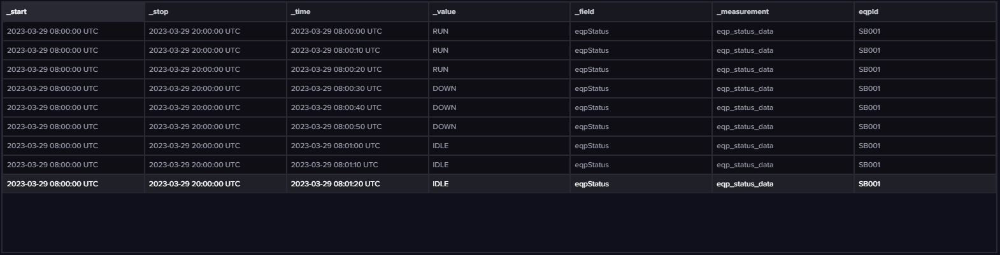
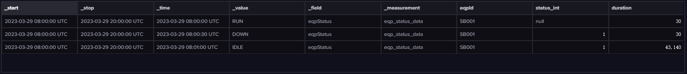
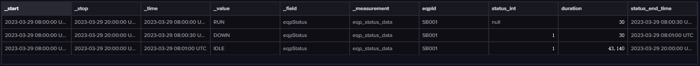

# 机况

## 导入数据
行协议数据：
```yaml
eqp_status_data,eqpId=SB001 eqpStatus="RUN" 1680076800000000000
eqp_status_data,eqpId=SB001 eqpStatus="RUN" 1680076810000000000
eqp_status_data,eqpId=SB001 eqpStatus="RUN" 1680076820000000000
eqp_status_data,eqpId=SB001 eqpStatus="DOWN" 1680076830000000000
eqp_status_data,eqpId=SB001 eqpStatus="DOWN" 1680076840000000000
eqp_status_data,eqpId=SB001 eqpStatus="DOWN" 1680076850000000000
eqp_status_data,eqpId=SB001 eqpStatus="IDLE" 1680076860000000000
eqp_status_data,eqpId=SB001 eqpStatus="IDLE" 1680076870000000000
eqp_status_data,eqpId=SB001 eqpStatus="IDLE" 1680076880000000000
```

## 查询
原始数据：
```js
from(bucket: "pub_bucket")
  |> range(start: 2023-03-29T08:00:00.000000000Z, stop: 2023-03-29T20:00:00.000000000Z)
  |> filter(fn: (r) => r["_measurement"] == "eqp_status_data")
  |> filter(fn: (r) => r["_field"] == "eqpStatus")
  |> filter(fn: (r) => r["eqpId"] == "SB001")
  |> yield(name: "mean")
```


根据指定列去重，保留最后一个重复的 point ：

```js
import "contrib/tomhollingworth/events"

from(bucket: "pub_bucket")
  |> range(start: 2023-03-29T08:00:00.000000000Z, stop: 2023-03-29T20:00:00.000000000Z)
  |> filter(fn: (r) => r["_measurement"] == "eqp_status_data")
  |> filter(fn: (r) => r["_field"] == "eqpStatus")
  |> map(
      fn: (r) => ({r with
          status_int: if r._value == "RUN" then
              0
          else if r._value == "DOWN" then
              1
          else if r._value == "IDLE" then
              2
          else
              3,
      }),
  )
  |> difference(columns: ["status_int"], keepFirst: true)
  |> filter(fn: (r) => not exists r.status_int or r.status_int != 0)
  |> events.duration(unit: 1s, stop: 2023-03-29T20:00:00.000000000Z)
  |> yield(name: "mean")
```


完善结束时间 \_time + duration = status\_end\_time ：

```js
import "contrib/tomhollingworth/events"
import "date"

from(bucket: "pub_bucket")
  |> range(start: 2023-03-29T08:00:00.000000000Z, stop: 2023-03-29T20:00:00.000000000Z)
  |> filter(fn: (r) => r["_measurement"] == "eqp_status_data")
  |> filter(fn: (r) => r["_field"] == "eqpStatus")
  |> map(
      fn: (r) => ({r with
          status_int: if r._value == "RUN" then
              0
          else if r._value == "DOWN" then
              1
          else if r._value == "IDLE" then
              2
          else
              3,
      }),
  )
  |> difference(columns: ["status_int"], keepFirst: true)
  |> filter(fn: (r) => not exists r.status_int or r.status_int != 0)
  |> events.duration(unit: 1ms, stop: 2023-03-29T20:00:00.000000000Z)
  |> map(
      fn: (r) => ({r with
          status_end_time: date.add(d: duration(v: r.duration * 1000000), to: r._time)
      }),
  )
  |> map(
      fn: (r) => ({r with
          duration_fmt: string(v: duration(v: r.duration * 1000000))
      }),
  )
  |> yield(name: "mean")
```

