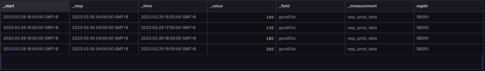
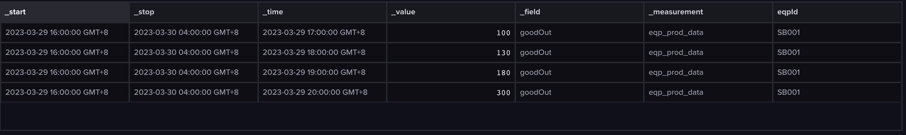

# 每小时产量

## 导入数据
行协议数据：
```yaml
eqp_prod_data,eqpId=SB001 goodOut=100 1680080100000000000
eqp_prod_data,eqpId=SB001 goodOut=130 1680083700000000000
eqp_prod_data,eqpId=SB001 goodOut=180 1680087300000000000
eqp_prod_data,eqpId=SB001 goodOut=300 1680090900000000000
```

## 查询
原始数据：
```js
from(bucket: "pub_bucket")
  |> range(start: 2023-03-29T08:00:00.000000000Z, stop: 2023-03-29T20:00:00.000000000Z)
  |> filter(fn: (r) => r["_measurement"] == "eqp_prod_data")
  |> filter(fn: (r) => r["_field"] == "goodOut")
  |> filter(fn: (r) => r["eqpId"] == "SB001")
  |> yield(name: "mean")
```


每小时产量：
```js
from(bucket: "pub_bucket")
  |> range(start: 2023-03-29T08:00:00.000000000Z, stop: 2023-03-29T20:00:00.000000000Z)
  |> filter(fn: (r) => r["_measurement"] == "eqp_prod_data")
  |> filter(fn: (r) => r["_field"] == "goodOut")
  |> filter(fn: (r) => r["eqpId"] == "SB001")
  |> aggregateWindow(every: 1h, fn:last, createEmpty: false)
  |> yield(name: "mean")
```


