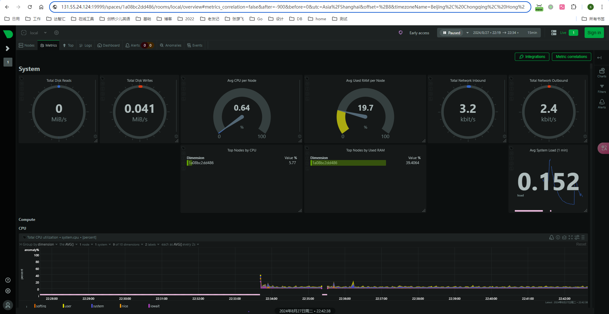

# Docker安装Netdata

## docker-compose.yml
```yml
version: '3'
services:
  netdata:
    image: netdata/netdata
    #image: m.daocloud.io/docker.io/netdata/netdata
    container_name: netdata
    pid: host
    restart: unless-stopped
    cap_add:
      - SYS_PTRACE
      - SYS_ADMIN
    security_opt:
      - apparmor:unconfined
    volumes:
      - netdataconfig:/etc/netdata
      - netdatalib:/var/lib/netdata
      - netdatacache:/var/cache/netdata
      - /:/host/root:ro,rslave
      - /etc/passwd:/host/etc/passwd:ro
      - /etc/group:/host/etc/group:ro
      - /etc/localtime:/etc/localtime:ro
      - /proc:/host/proc:ro
      - /sys:/host/sys:ro
      - /etc/os-release:/host/etc/os-release:ro
      - /var/log:/host/var/log:ro
      - /var/run/docker.sock:/var/run/docker.sock:ro
    networks:
      biz_net:
    ports:
      - "19999:19999"

volumes:
  netdataconfig:
  netdatalib:
  netdatacache:

networks:
  biz_net:
    name: biz_net
    driver: bridge
    ipam:
      config:
        - subnet: 192.168.100.0/24
          gateway: 192.168.100.1
```

## 访问

