# Win12安装LoadRunner11

## 安装
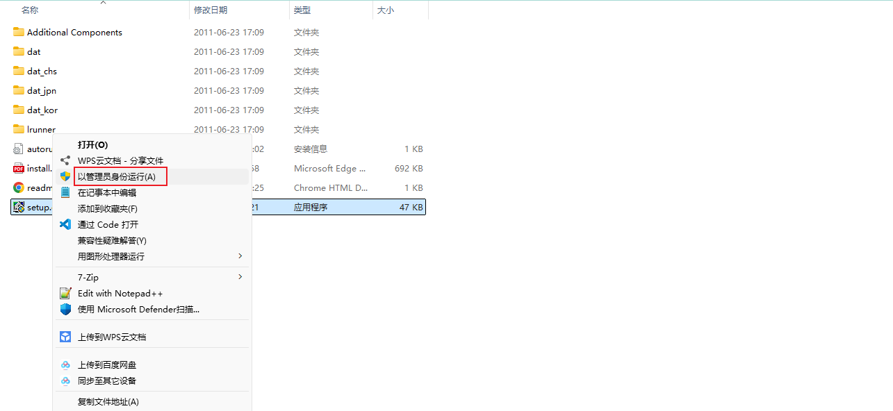

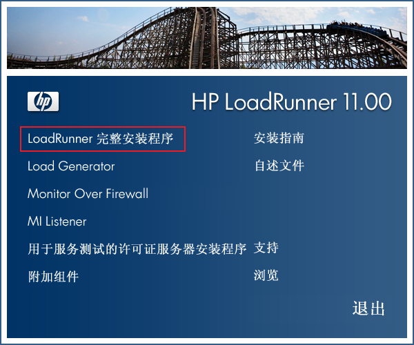

需要安装依赖组件：
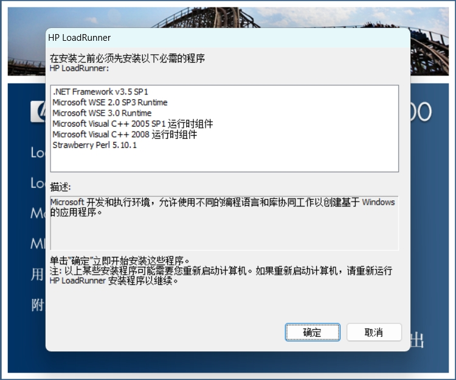

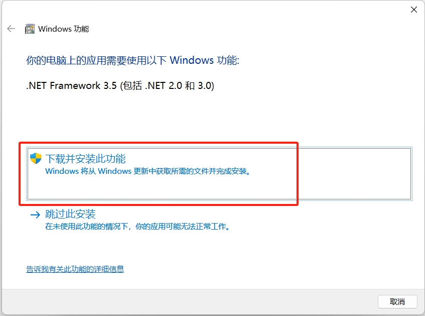

安装完成之后，重启电脑。

安装 Microsoft Visual C++ 2005 运行时组件：

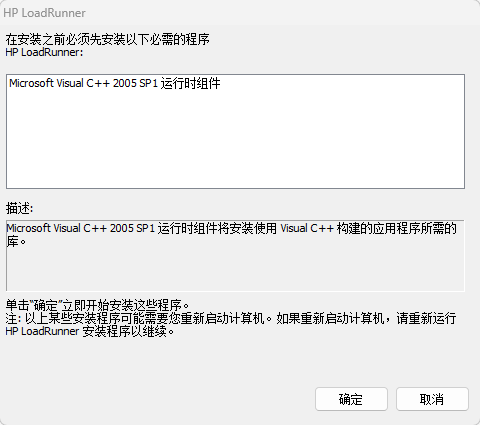

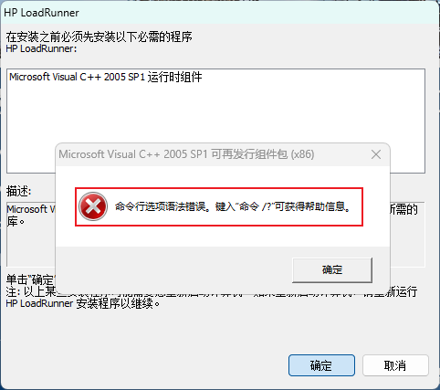

直接安装会报错，要先进入到安装包的 loadrunner-11\Additional Components\IDE Add-Ins\MS Visual Studio .NET 目录，手动安装：

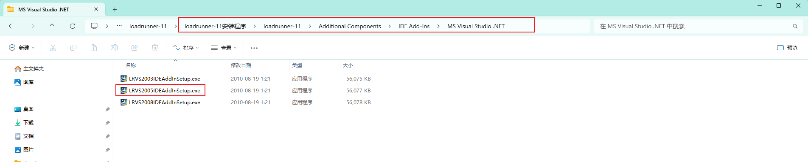

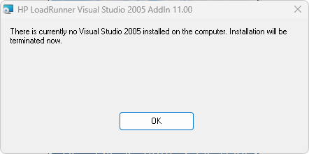

安装完成之后，再重新安装 LoadRunner ：

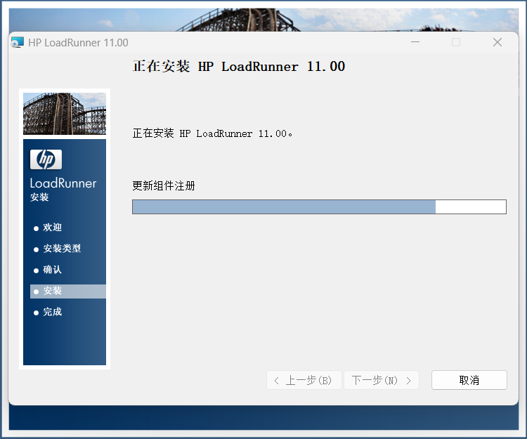

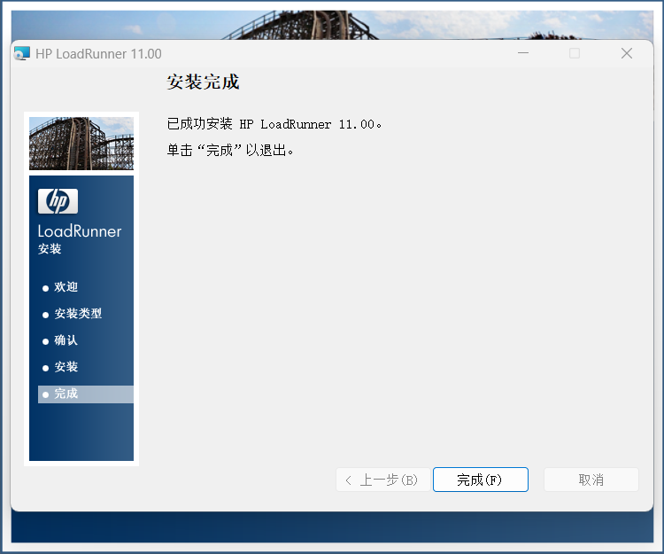


## 破解
需要严格安装顺序操作：

1. 用破解目录中的 mlr5lprg.dll 和 lm70.dll 文件覆盖 LR11 安装目录下 bin 文件夹中的对应文件。

2. 运行 deletelicense.exe

3. 管理员打开 LoadRunner - Configurations - New Lisence ，创建新的 Lisence 。

```
超级license 最高支持6.5w个并发：AEACFSJI-YJKJKJJKEJIJD-BCLBR
```

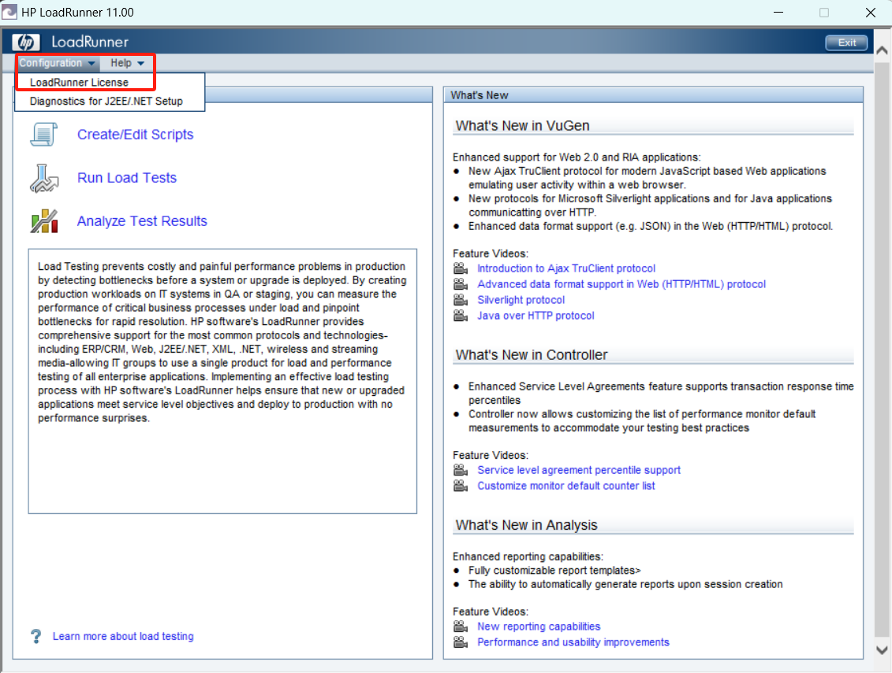

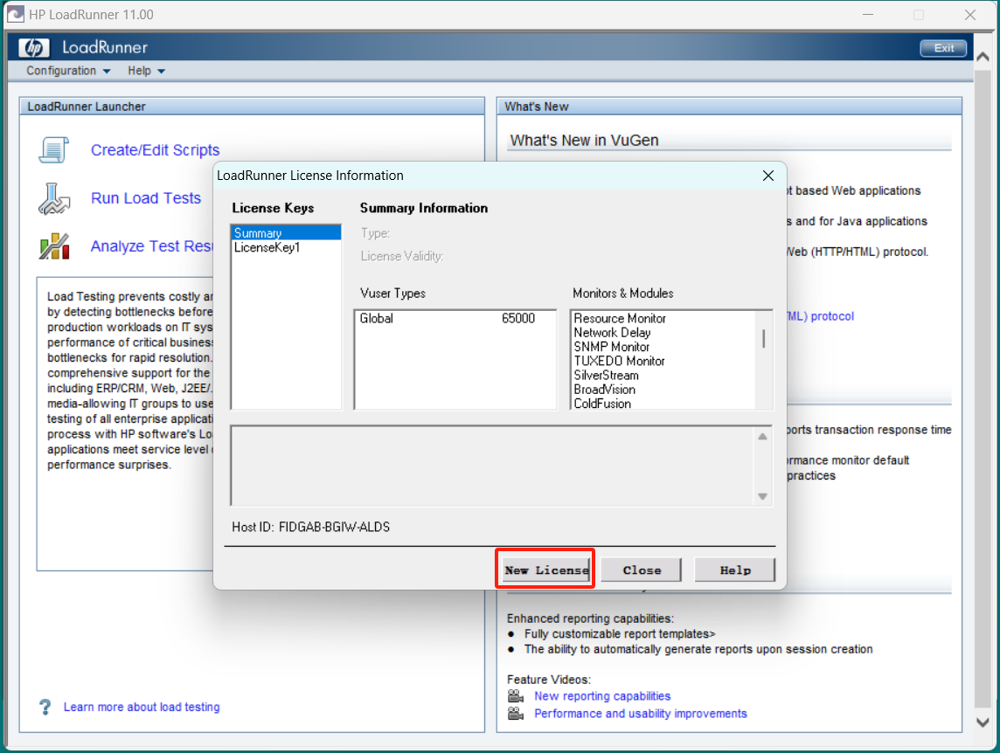

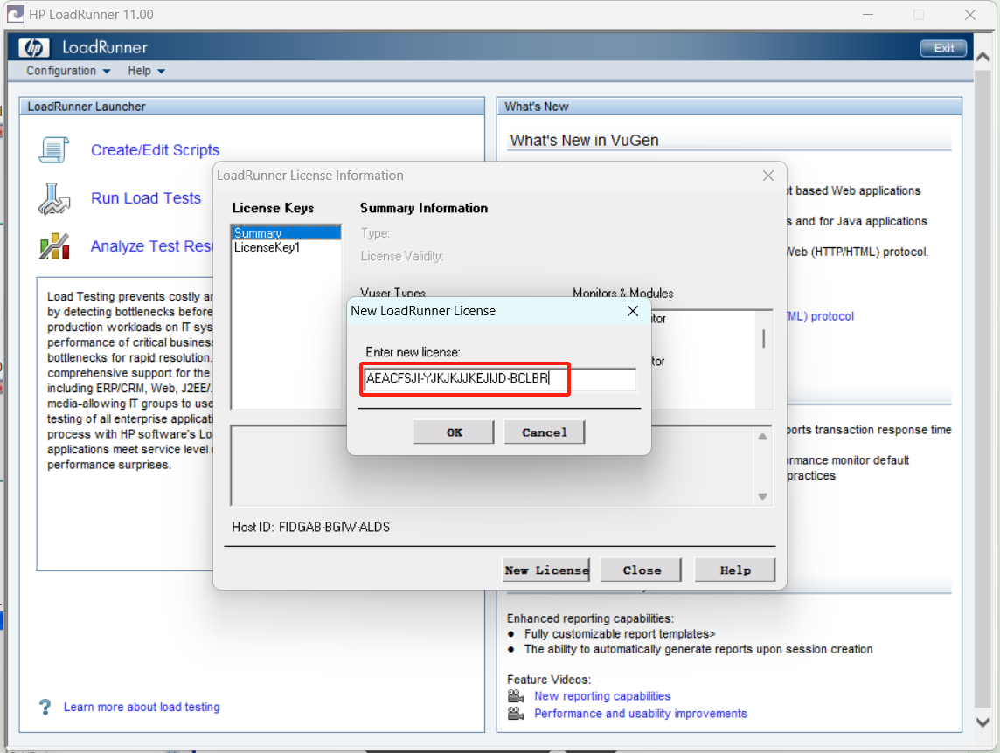

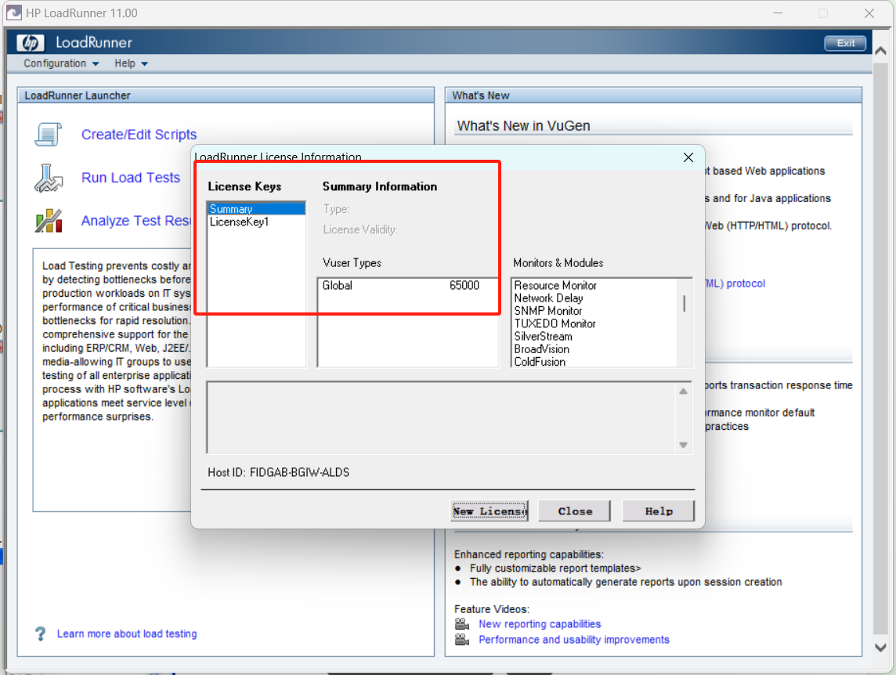
